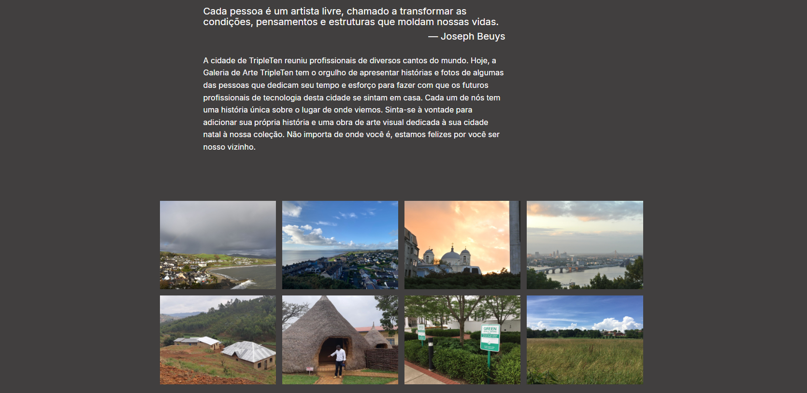

# Homeland Web Project

## Live Demo

https://rodrigomzanetti.github.io/web_project_homeland/

## Preview

## Overview

Homeland is a responsive landing page built using HTML and CSS. The project focuses on structured content layout, clear visual hierarchy, and responsive design principles.

It was created to practice front-end fundamentals such as semantic HTML structure, layout organization, and responsive styling without the use of external frameworks.

## Features

- Structured landing page layout
- Semantic HTML sections
- Responsive design for different screen sizes
- Clean typography and spacing
- Organized visual hierarchy

## Technologies Used

- HTML5 – semantic structure and page organization
- CSS3 – layout, styling, and responsiveness
- Responsive design principles

## Project Structure

web_project_homeland/

- index.html – main application markup
- style.css – global styles
- images/ – project assets
- favicon.ico – website icon

## How to Run the Project

- Clone the repository
git clone https://github.com/RodrigoMZanetti/web_project_homeland.git

- Navigate to the project folder
cd web_project_homeland

- Open the project
Open **index.html** in your browser or run a local development server if preferred.

## Status

Completed as part of front-end development training.

## Problem Solving

The main focus of this project was building a clean and structured layout using semantic HTML and CSS. Special attention was given to maintaining consistent spacing, readable typography, and responsive behavior across different screen sizes.

The layout was organized into clear sections, improving content readability and visual hierarchy while ensuring the page loads efficiently without external frameworks.

## What I Learned

During this project I practiced:

- Structuring semantic HTML layouts
- Building responsive page sections with CSS
- Organizing visual hierarchy through spacing and typography
- Applying responsive design principles
- Developing static landing pages with clean structure

## Author

Rodrigo M. Zanetti

GitHub  
https://github.com/RodrigoMZanetti

LinkedIn  
https://www.linkedin.com/in/rodrigomzanetti
