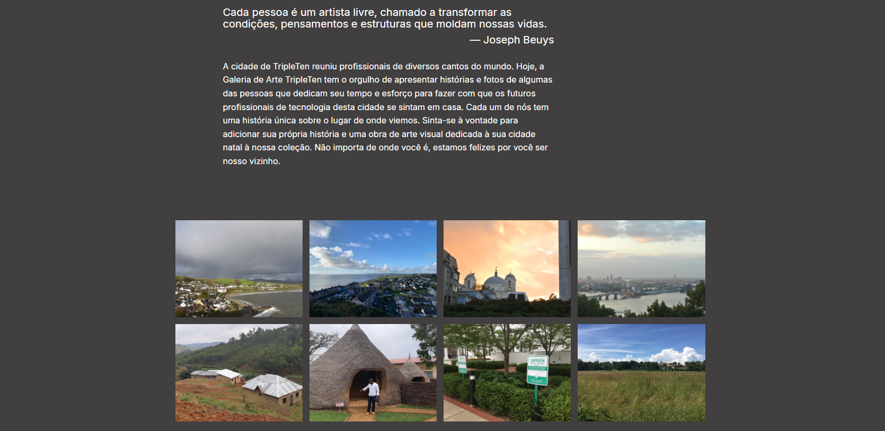

# Homeland

A responsive landing page showcasing stories and photos from different cities around the world — Wales, USA, Burundi, and Brazil. Built as part of the TripleTen Web Development program.

## Live Demo

https://rodrigomzanetti.github.io/web_project_homeland/

## Preview

## Tech Stack

- **Frontend:** HTML5, CSS3

## Features

- Responsive layout for mobile and desktop
- Semantic HTML structure
- Photo grid and location cards
- Clean typography and visual hierarchy

## Running Locally

Clone the repository and open `index.html` in your browser.

## Author

Rodrigo Zanetti — [LinkedIn](https://linkedin.com/in/rodrigomaturanozanetti) · [GitHub](https://github.com/RodrigoMZanetti)
